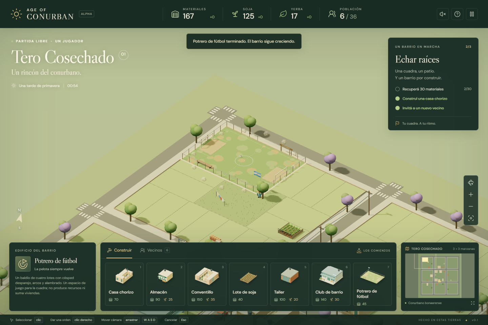

# Age of Conurban — Tero Cosechado

Juego de estrategia y construcción para un jugador, ambientado en **Tero Cosechado**, un barrio imaginario del conurbano bonaerense. Juntá materiales, soja y yerba, sumá vecinos y levantá casas chorizo, conventillos, almacenes de esquina, clubes y potreros, lote por lote.

Esta es la **etapa 1**: una maqueta viva, sin combate, hecha con [Three.js](https://threejs.org/) y [Vite](https://vite.dev/). Corre en el navegador y no necesita backend.



## Contenido

- [Qué hay en el juego](#qué-hay-en-el-juego)
- [Cómo jugar](#cómo-jugar)
- [Controles](#controles)
- [Edificios](#edificios)
- [Instalación y uso](#instalación-y-uso)
- [Estructura del proyecto](#estructura-del-proyecto)
- [Pruebas](#pruebas)
- [Publicación](#publicación)
- [Estado y próximos pasos](#estado-y-próximos-pasos)

## Qué hay en el juego

- **Un barrio de 3 × 3 manzanas.** Cada una tiene 18 lotes: siete sobre las calles norte y sur, y dos sobre las calles este y oeste. El centro son los fondos de las casas.
- **Colocación por lotes.** Al elegir una construcción, la vista previa salta al lote bajo el cursor y se orienta sola con el frente a la calle.
- **Tres recursos:**
  - **materiales**, que se recuperan de acopios;
  - **soja**, que se cosecha en cultivos;
  - **yerba**, que se retira de proveedurías.

  Los tres están en lotes baldíos que se liberan cuando el recurso se agota.
- **Vecinos con nombre.** Caminan por calles, veredas y pasillos, y cada uno trabaja en su propio lugar junto al recurso o la obra.
- **Obras por etapas.** Primero se ven el encofrado, el basamento de hormigón y los hierros. Después el edificio crece entre andamios y, al terminar, se levanta una nube de polvo.
- **Detalles del barrio:**
  - bandera argentina en clubes y potreros;
  - arbolado con jacarandás, postes y cables;
  - autos estacionados y tanque de agua;
  - vías del tren y surcos de soja en el borde.
- **Objetivos introductorios, pausa y guardado local**, con una interfaz que también funciona en pantallas táctiles.

## Cómo jugar

Arrancás con 280 materiales, 120 de soja, 20 de yerba y cinco vecinos: Ramón, Juana, Pedro, Rosa y Segundo. El barrio ya tiene seis casas chorizo, un conventillo, la sociedad de fomento, un club y un lote de soja.

1. **Juntá recursos.** Hacé clic en un vecino y después clic derecho sobre un acopio, un cultivo o un puesto de yerba.
2. **Dejá a alguien libre.** Toda obra nueva necesita un vecino sin tarea.
3. **Construí.** Elegí un edificio con las teclas 1 a 7, pasá el cursor por un lote libre y hacé clic cuando la vista previa esté verde.
4. **Sumá vecinos.** En la pestaña **Vecinos**, **Invitar** cuesta 25 de soja y 3 de yerba, gracias al club. Cada vecino nuevo necesita un lugar libre en las viviendas.
5. **Automatizá.**
   - Los lotes de soja y los almacenes producen solos.
   - Un almacén en un lote de esquina rinde el doble.
   - Un taller acelera la recuperación de materiales.

Los tres objetivos iniciales son: recuperar 30 materiales, construir una casa chorizo e invitar a un vecino. Después podés seguir construyendo libremente.

## Controles

| Acción | Mouse y teclado | Pantalla táctil |
|---|---|---|
| Seleccionar | Clic | Tocar |
| Mover o asignar un vecino | Clic derecho sobre el terreno, un recurso o una obra | Con el vecino elegido, tocar el destino |
| Mover la cámara | Arrastrar el mapa, <kbd>W</kbd> <kbd>A</kbd> <kbd>S</kbd> <kbd>D</kbd>, flechas o clic en el minimapa | Arrastrar con un dedo |
| Zoom | Rueda o botones + / − | Pellizcar |
| Girar la cámara | Botón central y arrastrar, o botón de rotar | Girar con dos dedos |
| Construir | Teclas <kbd>1</kbd>–<kbd>7</kbd> o las tarjetas del catálogo | Tocar la tarjeta y después el lote |
| Cancelar | <kbd>Esc</kbd> o clic derecho | Botón **Cancelar** |
| Pausa, guardar y cargar | <kbd>Espacio</kbd> o botón de pausa | Botón de pausa |

## Edificios

| Tecla | Edificio | Costo | Lotes | Efecto |
|---|---|---|---|---|
| 1 | Casa chorizo | 70 materiales | 1 | +4 lugares de vivienda |
| 2 | Almacén | 90 materiales + 25 soja | 1 | +1 yerba cada 5 s (+2 en esquina) |
| 3 | Conventillo | 150 materiales + 35 soja | 2 | +8 lugares de vivienda |
| 4 | Lote de soja | 40 materiales | 1 | +3 soja cada 5 s |
| 5 | Taller | 100 materiales + 20 soja | 2 | +25% al recuperar materiales (no se acumula) |
| 6 | Club de barrio | 140 materiales + 30 soja | 2 | Abarata las invitaciones (no se acumula) |
| 7 | Potrero de fútbol | 45 materiales | 4 | Espacio de juego, sin producción |

Los tiempos de obra, las reglas completas y los criterios de diseño están en [REGLAS_Y_MANUAL.md](./REGLAS_Y_MANUAL.md).

## Instalación y uso

### Requisitos

- **Node.js 20.19 o posterior, o 22.12 o posterior**, con npm. Es lo que pide Vite 7.
- **Un navegador con WebGL 2.**

### Poner en marcha

```sh
git clone https://github.com/meryboth/age-of-conurbano.git
cd age-of-conurbano
npm install
npm run dev
```

Abrí <http://localhost:5173>. El puerto es fijo: si ya está ocupado, Vite avisa en vez de usar otro.

### Scripts

| Comando | Qué hace |
|---|---|
| `npm run dev` | Servidor de desarrollo con recarga automática |
| `npm test` | Pruebas unitarias de economía y loteo (`node --test`) |
| `npm run build` | Compilación de producción en `dist/` |
| `npm run preview` | Sirve la compilación de `dist/` para revisarla |

### Guardado

La partida se guarda **a mano** desde el menú de pausa, en el `localStorage` del navegador, con la clave `conurban-barrio-v3`. Tené en cuenta lo siguiente:

- Queda solo en ese navegador y dispositivo.
- Hay un único espacio de guardado.
- Al abrir el juego, la partida no se carga sola.
- Las partidas del mapa anterior (`v2`) no son compatibles con el mapa actual.

## Estructura del proyecto

```text
├── index.html              Entrada de la página
├── src/
│   ├── main.js             Interfaz, órdenes, simulación, caminos, cámara, guardado
│   ├── world.js            Mapa, modelos 3D, obras, recursos y miniaturas del catálogo
│   ├── economy.js          Catálogo, costos, trazado de manzanas y reglas de lotes
│   └── style.css           Estilos de la interfaz
├── tests/economy.test.js   Pruebas unitarias
├── scripts/playthrough.mjs Recorrido automatizado en navegador (Playwright)
├── public/favicon.svg
├── docs/captura.png        Captura usada en este README
└── REGLAS_Y_MANUAL.md      Manual de juego y documentación técnica
```

Los modelos no usan archivos externos: todo se arma con geometrías de Three.js. La escenografía fija y los edificios terminados se fusionan en una malla por material, para mantener fluido el mapa grande.

Para cambiar el balance (costos, tiempos, capacidad y tamaños), editá `BUILDINGS` en `src/economy.js`. Si cambiás los valores, actualizá también el manual.

## Pruebas

```sh
npm test
```

Las pruebas unitarias cubren:

- costos;
- superposición de edificios;
- rotación;
- trazado de manzanas;
- orientación del frente;
- edificios de varios lotes;
- lotes de esquina.

El recorrido en navegador levanta el juego real y comprueba:

- recolección de recursos;
- construcción por lote;
- rechazo de lotes con recursos;
- invitación, pausa, guardado y carga;
- el potrero;
- el diseño en celular;
- que no haya errores en la consola.

Para correrlo, con el servidor de desarrollo encendido:

```sh
node scripts/playthrough.mjs
```

El script importa Playwright desde una ruta del entorno donde se creó. Para usarlo en otra máquina, instalá Playwright y ajustá el `require` del principio del archivo.

## Publicación

`npm run build` genera un sitio estático en `dist/`, que se puede subir a cualquier hosting de archivos estáticos: GitHub Pages, Netlify, Vercel u otro. El juego no usa servidor ni base de datos.

Si lo publicás en una subcarpeta (por ejemplo, `usuario.github.io/age-of-conurbano/`), configurá `base` en `vite.config.js` con esa ruta.

## Estado y próximos pasos

La etapa 1 es para un jugador y **no tiene** combate, rival, multijugador ni partidos en el potrero. Para acercarse a un *Age of Empires* del conurbano, la idea para la próxima etapa es:

1. **Un barrio rival** manejado por la computadora.
2. **Edades del barrio:** Loteo → Barrio → Municipio → Conurbano, con nuevos edificios y mejoras en cada una.
3. **Disputa de manzanas y partidos entre barrios** en el potrero.
4. **Más economía:** plata y comercio.
5. **Mejoras de juego:** selección múltiple y niebla de guerra.

El detalle de lo implementado y lo pendiente está en las secciones *Alcance y límites* y *Posibles etapas futuras* del [manual](./REGLAS_Y_MANUAL.md).

---

Hecho en estas tierras. ✦
